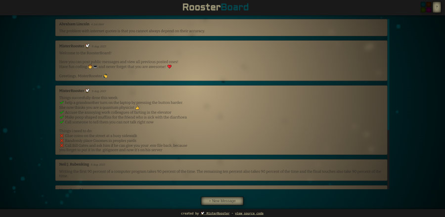

# Rooster Board


Simple message board using serverside rendering and a database that allows users to write messages on a public board.
Users can create new messages which than gets stored in a MongoDB database instance.

This Projects main purpose was to practice full-stack development. Feel free to use it as an inspiration or as
a learning resource.

## Features:
 - Express server with NodeJS
 - Serverside rendering via PugJS template engine
 - MongoDB database synchronization via mongoose
 - Dynamic background rendered on the clientside
 - Rate limitation, request compression and form validation checks
 - Written in Typescript

## How to run it locally

 As a prerequisite you must either have [MongoDB Community Server](https://www.mongodb.com/try/download/community) installed locally or have an MongoDB Atlas account (you can create one for free [here](https://www.mongodb.com/cloud/atlas/register)).
 Also make sure to have NodeJS version `16.17.0` or above installed.

After that clone the repository locally (if you havent already):

```bash
git clone git@github.com:MisterRooster/rooster-board.git
```

Then move to the project directory and install dependencies:

```bash
cd rooster-board
npm install
```

Now copy the `.env.example` environment configuration file as `.env` at the root of the project and add your cluster connection string url `DB_URL` (replace your username and password) and database name `DB_NAME`:

```bash
DB_URI=mongodb+srv://<username>:<password>@<clustername>.mongodb.net/
```
You can also change the server port via `PORT` and node environment variable `NODE_ENV` here if you like.
For a local MongoDB installation the string looks like the following (no authentication needed):

```bash
DB_URI=mongodb://127.0.0.1:27017
```

Then start the server locally with the following command:

```bash
npm deploy
```

If you want a development server with HMR use:

```bash
npm run dev
```

---

Copyright (c) 2023 MisterRooster ([github.com/MisterRooster](https://github.com/MisterRooster)). All rights reserved.  
Licensed under the MIT license. See [LICENSE](LICENSE) for full terms.
